# 2 The quantitative rules 量化规则

Probability theory is nothing but common sense reduced to calculation.

Laplace, 1819

We have now formulated our problem, and it is a matter of straightforward mathematics to work out the consequences of our desiderata, which may be stated broadly as follows: 

(I) Representation of degrees of plausibility by real numbers; 

(II) Qualitative correspondence with common sense; 

(III) Consistency. 

The present chapter is devoted entirely to deduction of the quantitative rules for inference which follow from these desiderata. The resulting rules have a long, complicated, and astonishing history, full of lessons for scientific methodology in general (see the Comments sections at the end of several chapters).

概率论只不过是将常识归结为计算罢了,除此之外什么都不是。

--拉普拉斯，1819年

现在我们已经明确的表达出我们的问题了，接下来的事就是通过计算得到基本公理的结果了，基本公理可以大致上陈述为：

（I）用实数来表示可信度(合情度);

（II）与常识的定性对应;

（III）一致性。

本章致力于从这几个基本公理演绎出推理的量化规则。 这些规则有一个漫长而复杂到令人惊讶的历史，充满了人类学到的广义上的科学方法论的各种教训（见几章末尾的评论部分）。

## 2.1 The product rule 积的规则

我们先试图到乘积的一致性规则,即确定分开的A和B的可信度,与积AB的可信度的之间的关系。特定的，我们要找到AB|C。由于推理过程有点微妙，我们将从几个不同的角度来审查它。

首先注意到,判定AB为真的过程可以分解成为分开判定A和B。机器人可以采取的步骤是:

(1) 判定B为真；                             （B|C）

(2）已经接受B为真，判定A为真。            （A|BC）

或者，等价的:

(1') 判定A为真；                             （A|C）

(2') 已经接受A为真，判定B为真。            （B|AC）

在这两种情况下，上面的每一步都对应着的可信度。

现在让我们详细描述第一种步骤。AB为真则要求B必须为真,因此需要知道B|C的可信度。接着如果B为真则进一步要求A为真,因此还需要知道A|BC的可信度。但如果B是假的，则AB必然为假，且与A的真假无关，用 A|\bar{B}C 来表示。如果机器人先判断B，那么只有命题B为真时，才有必要考虑命题A的合情度。因此，如果机器人知道B|C和A|BC，那么就不需要知道A|C,因为A|C没有告诉机器人任何关于AB的信息。

因为逻辑积满足可交换律，即AB=BA，我们可将上面陈述中的A和B对换.即A|C和B|AC将同样有助于确定AB|C=BA|C。按从上面任一步骤,机器人都应对AB|C得出相同的值，即要符合基本公理(Ⅲa)的一致性条件要求。

我们可以用更明确的形式来阐述。(AB|C）可以是B|C和BC的一个函数:

(AB|C) = F[(B|C),(A|BC)].   (2.1)

现在，如果上面的推理看起来不那么显而易见的话，让我们换种方式看看。例如，我们一种可行的方式:

(AB|C) = F[(A|C),(B|C)]     (2.2)

不过容易看出，这种方式的任何关系都不能满足基本公理(Ⅱ)的条件。当给定C时命题A的可信度可能很高，同时在给定C时命题B的可信度也可能很高，但命题AB的可信度既可能很高也可能很低。

举例来说，你遇到了一个人,有可能他的眼睛是蓝色的,也可能他的头发是黑色的。如果二者都有的，也是合情合理的。另一方面，你遇到一个人,他左眼是蓝色的,然后你遇到的下一个人右眼是棕色，这都是相当合情理的。但如果你遇到的一个人,他的左眼是蓝色的而右眼是棕色的，这则是件令人难以置信的事情。如果我们试图使用公式(2.2)，我们将无法将这种事情包括进来。机器人不能用这种函数来像人类一样推理，即使是定性的也不行。

But other possibilities occur to us. The method of trying out all possibilities – a kind of ‘proof by exhaustion’ – can be organized as follows. Introduce the real numbers

但是我们还有其他的可能性。尝试所有的可能的方式--穷尽所有方式的证明—可以组织如下。引入实数:

u=(AB|C), v=(A|C), w=(B|AC), x=(B|C), y=(A|BC).  (2.3)

如果u可以表示为v,w,x,y中的两个或两个以上的函数，则一共有11种可能的方式。你可以列出每一种，就如棕色和蓝色眼睛的例子里一样(这是一个抽象语句︰A蕴含着B为假)，然后对比于各种极端情况。一些极端情况有A=B,A=C,C\Rightarrow\bar{C} 等等。展开分析所有的方式是件琐碎的工作，Tribus (1969)发现除了两种方式外,其他的都会在一些极端情况和常识相违背。这两种分别是u=F(x,y)和u=F(w,v)，正好是我们前面推理得出的两个函数形式。

现在应用第一章中所讨论的定性条件。给定先验信息的任意一个变化C \to C' ，使得命题B的可信度增加而命题A的可信度不变，

B|C' > B|C, (2.4)

A|BC' = A|BC, (2.5)

根据常识,AB的可信度应该增加，而不是减少：

AB|C' ≥ AB|C,   (2.6)

仅当且当A|BC不能发生时等号成立。类似的，给定先验信息C''有

B|C'' = B|C,    (2.7)

A|BC'' > A|BC,  (2.8)

我们要求在

AB|C'' ≥ AB|C, (2.9)

中，仅当给定C时命题B不可能发生时等号成立（即使AB未被定义，给定C''的情况下A|BC依然不可能发生）。进一步的，函数F(x,y)应该是连续的，否则等式(2.1)右边任何一个可信度的任意小的增加，可能导致AB|C可信度的巨大的增加。

总之，F(x,y)必须是x和y的连续单调递增函数。如果我们假设它是可导的（可导不是必须的，见（2.13）之后的讨论），那么我们有

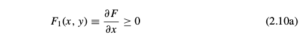

与当且仅当y表示不可能时取等号；并且

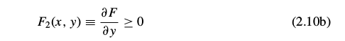

当且仅当x表示不可能时取等号。注意在这种表示法中,为了以后的需要,F_i表示对第i个自变量进行求导，无论第i个自变量具体是什么。

接下来，我们重点转向基本公理（Ⅲa）的“结构”一致性。假设我们尝试确定（ABC|D）的三个命题同时为真的可信度。事实上，因为布尔代数符合结合律：ABC=(AB)C=A(BC)，所有可以有两种顺序来计算。如果规则满足一致性，那么用两种顺序中的任何一种来运算，得到结果应该是一样的。我们就可以说，先将BC看成一个命题，然后应用(2.1)：

(ABC|D) = F[(BC|D), (A|BC D)],   (2.11)

然后对于BC|D，我们可以再次应用(2.1)得到

(ABC|D) = F{F[(C|D), (B|CD)], (A|BCD)}.   (2.12a)

但同样也可以先将AB看成一个命题。按此顺序可以推出另一个表达式︰

(ABC|D) = F[(C|D), (AB|CD)] = F{(C|D), F[(B|CD), (A|BCD)]}.   (2.12b)

如果积规则是一致的推理方式，那么表达式(2.12a)和(2.12b)必须始终是相同的。在这种情况下我们的机器人的推理满足一致性的必要条件是，函数的形式满足等式:

F[F(x, y), z] = F[x, F(y, z)].    (2.13)

这个方程在数学中有悠久的历史，从N.H.Abel (1826)的工作开始。Acz´el (1966)在他的巨著中对泛函方程，十分恰当地叫它‘结合律方程’，并列出98篇参考文献来讨论或使用它。Acz´el在不要求可微的前提下推导出了如下的通用解(2.27),不幸的是，他的证明用了11页(第256-267页)（同样可见于Acz´el，1987）。下面是R.T.Cox（1961）给出的简洁证明，前提是满足可微.更多的请参见在附录B中的讨论。

显然(2.13)拥有平凡解，F(x,y)等于常数。但这违反了我们的单调性要求(2.10)，而且在任何情况下对我们的目标都是毫无用处。除非(2.13)有一个非平凡解，否则我们的企图会失败；因此我们要找到最通用的非平凡解。下面简写为:

u≡F(x,y),  v≡F(y,z),   (2.14)

但(x,y,z)仍作为独立变量，函数方程为

F(x,v) = F(u,z).     (2.15)

对x和y分别求微分，并使用用(2.10)的记法有:

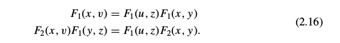

从这些方程中将F_1(u,z)消掉得到

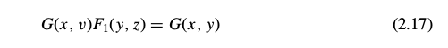

这里记G(x,y)\equiv F_2(x,y)/F_1(x,y)。显然，(2.17)的左边必须独立于z。此时，(2.17)可以被写成

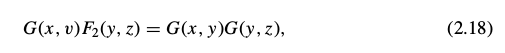

同时将(2.17)和(2.18)的左边分别用U,V来表示。我们可证\partial V/ \partial y = \partial U/ \partial z 。则G(x,y)G(y,z)必然与y相互独立。最通用的函数G(x,y)具有的性质是:

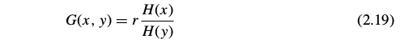

这里的r是一个常数，H(x)是任意函数的。在此时的情况下，因为F是单调的所以G>0，所以我们要让r>0，同时H(x)在值域上正负不变。用(2.19)、(2.17)和(2.18)得到

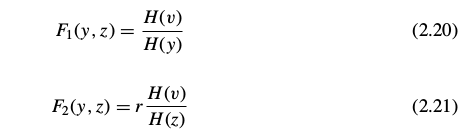

则关系 dv=dF(y,z)=F_1 dy + F_2 dz 的形式为:

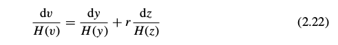

或者，积分的形式

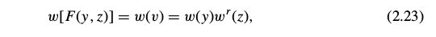

其中

积分没有下界表示w包含一个任意的乘法因子。但是在(2.15)的中应用函数W(.)和(2.23)，我们得到 w(x)w^r (v)=w(u)w^r (z) ；再次应用(2.23)，我们的函数等式变为:

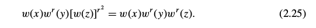

这意味着，在仅当r=1时我们得到了一个非平凡解，同时我们的最终结果可以表示为一下两个形式中的任意一个：

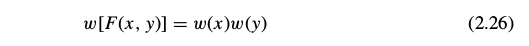

或

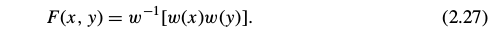

根据逻辑积的结合律和交换律,我们试图找到的关系可以表达为如下的函数形式:

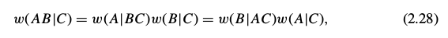

今后，我们应称之为积规则。由(2.24)的构造可知，w(x)必须是取值为正的单调连续函数，根据H(x)的正负而递增或递减.在目前为止，它的其他性质是任意的。

结果(2.28)是根据基本公理（Ⅲa）的一致性得出的一个必要条件。反过来，显然(2.28)也足以确保任意个单命题组成的复合命题的一致性。例如，根据(2.12),我们可以用很多种方式来分解(ABCDEFG|H）,但只要要满足(2.28)，得到的结果就都是一样的。

与常识保持定性的一致性给函数w(x)施加了进一步的限制。例如，在(2.28)的第一个形式中给定假设：给定C的条件下A是确定的。然后，在由知识C的所产生的逻辑环境中，在一个是真当且仅当另一个是真的意义上，命题AB和B是相同的。通过我们在第1章中讨论的基础公理，相同的真值的命题的可信度应该相等：

AB|C = B|C, (2.29)

同时还有

A|BC = A|C (2.30)

因为如果给定C下A已经确定（即C蕴含A），然后，在给定的任何其他信息中B与C互不矛盾，A仍然确定的。在这种情况下，(2.28)简化为

w(B|C) = w(A|C)w(B|C),  (2.31)

同时对于机器人来说不管B的可信度是多高多低，这必然成立。所以，我们的函数w(x)必须具有性质:

确定性可以用w(A|C) = 1来表示.   (2.32)

现在，假设给定C的条件下A是不可能发生的。则给定C的条件下，命题AB也是不可能发生的：

AB|C = A|C,      (2.33)

同时，如果给定C的条件下A已经是不可能发生的，（即C蕴含着\bar{A} ）,然后,在进一步给出的任何信息B中且B与C互不违背时，A仍然是不可能发生的：

A|BC = A|C.   (2.34)

此处的(2.28)将被简化为

w(A|C) = w(A|C)w(B|C),     (2.35)

并且再次有，无论B合理度可能是什么，此方程必然成立。w(A│C)仅有两个值可以满足此条件:零或+\infty（可以排除-\infty，因为根据连续性的要求则W(B|C)可以取负值,从而和(2.35)矛盾)。

总之，与常识的定性保持对应要求w(x)是正的单调连续函数。它可以单调增或单调减。如果是单调增，它的值域必须是从表示不可能的0递增到表示确定的1。如果它是单调减的，其值域必须从表示不可能的\infty递减到表示确定的1。到目前为止，我们的条件没有要求w到底在这些区间内又冷了如何变化。

然而，这两种表示方式在实质上内容上是没有差别的。给定任一函数w_1 (x)，满足上述要求并且用\infty表示不可能，我们可以定义一个新的函数w_2 (x) \equiv 1/w_1 (x)，它同样满足上述要求且用0来表示不可能。因此，按惯例选择0≤w(x)≤1并不失一般性；也就是说，就内容而言，所有与基本公理相一致性的形式都已经包括在内了。（读者可以验证，我们可以选择相反的形式作为惯例；以此来发展整个理论及其应用，过程是相似的,内容是相同的,只是形式稍有陌生。）

## 2.2 The sum rule 和的规则
(译注:群主译,仅修正公式)

因为如今考虑被认为是亚里士多德式逻辑的命题，必须是真或假，其逻辑积A\bar{A}始终是假，逻辑和A+\bar{A}总是为真。A是假的合理度必须以某种方式依赖于为真的那个合理度。如果我们定义和，必须存在着某个的函数关系：

显然，与常识相一致的定性，需要S(u)在0≤u≤1上是连续的单调递减函数，切具有极值S(0)=1，S(1)=0。但它不能只是具有这些属性的任意函数，因为它必须符合积规则可以被写为AB或A\bar{B}的事实:

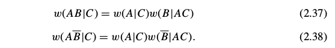

于是，利用(2.36)和(2.38)，则(2.37)变为

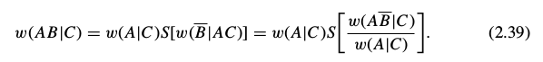

再一次的，我们利用了交换性：w(AB|C)在A,B是对称的，同时一致性要求

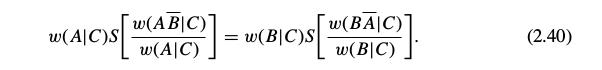

这对于所有命题A、B、C必须是成立的。特别是，(2.40)必须成立，当

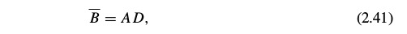

其中，D可以是任何的新命题。然后，我们得到在(1.13)之前标注的真值：

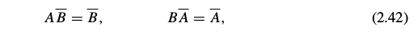

并且，在(2.40)中我们可以写做

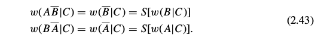

因此，使用缩写

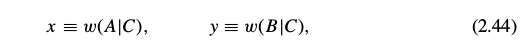

(2.40)变为函数方程

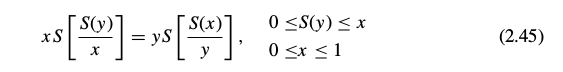

这表示一种缩放属性，即S(x)必须符合积规则。在y=1特殊情况下，这将简化为

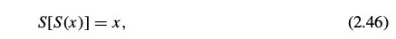

该式表明S(x)是一个自反身函数，S(x)=S^{-1}(x)。于是，从(2.36)可得到u=S(v)。但这只表示明显的有这样的实际关系：A\bar{A}和是互补的。不管我们用如何简单或禁止的字母所表示的命题。我们在(1.8)之前提到了这一点，如果不是在前面明显提到过，这不是容易辨认出来的。

在(2.45)中的域如下所示给出。命题D是任意的，，因此通过D的各种选择，我们在区间

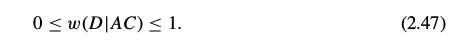

可以实现w(D|AC)的所有值，但S(y)=w(AD|C)=w(A|C)w(D|AC)，并且(2.47)只是(0≤S(y)≤x)，正如在(2.45)里所述。此域是关于x、y对称的;它可以写成与他们交换式同样的。几何上，它包括在单位平面（0≤x，y≤1）及以上的曲线y=S(x)在xy平面中的所有点。

事实上，该曲线的形状早已由(2.45)提到的上面的无数点所确定。如果我们设定y=S(x)+\epsilon，则当\epsilon \to 0^+时，(2.45)中的两项趋于S(1)=0，但在不同的水平上。因此，当\delta \to 0时，一切都取决于S(1-\delta)趋于零的确切方式。为了探讨这一点，我们定义一个新变量q(x,y)，该变量满足

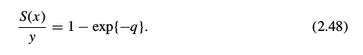

则，我们可以选择\delta =exp{-q}，通过下式定义方程J(q)

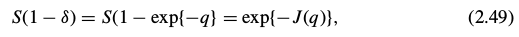

同时当时得到的渐进线。

现在考虑x,q作为独立变量，我们由(2.48)得到

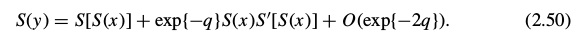

用(2.46)和它微分S"[S(x)]S'(x)=1，可以简化为

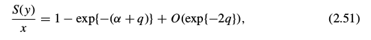

其中

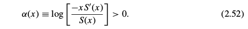

用这些替代元素，我们的方程(2.45)变为

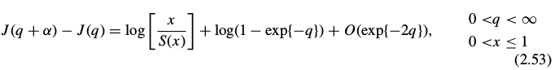

当时q \to \infty，后两项以指数增长的速度趋于零，所以J(q)必须为渐进线性的，

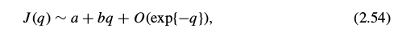

且有正的斜度

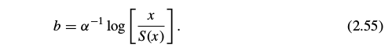

在(2.54)中，没有一个周期项的周期为\alpha，因为对于连续不同\alpha (x)值(2.53)必须满足，并且对于不同值也满足。但是，通过定义，J仅仅是一个关于q的方程，所以(2.55)右手边必须独立于x。用(2.52)得到

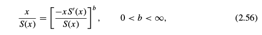

或者，重新整理，S(x)必须满足微分方程

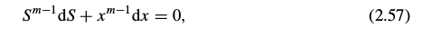

其中，m\equiv 1/b是某一常数。满足S(0)=1的唯一解是

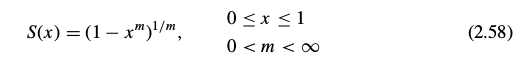

同时，反过来，我们可以马上证明(2.58)是(2.45)的一个解。

式(2.58)首先是由R. T. Cox (1946) 通过一个不同的前提条件得到，前提中假设S(x)可二次微分。再次被证明是Acz´el (1966)，其并没有假设可导。（但对现在的应用中假设可导对于我们来说是一个无害的步骤，如果方程可以引导我们到不可导的方程，我们该拒绝整个理论，因为它与常识相违背。）在任何事件中，(2.58)是满足方程(2.45)和左边界条件S(0)=1的最一般方程，同时我们发现它自动满足右边界条件S(1)=0。

推导(2.45)式时既然用到了对命题B来说特别的式子(2.41)，我们于是尽可以得到(2.58)是满足一致性要求(2.40)的必要条件。为了检验它的重复性，把(2.58)代入(2.40)，我们得到

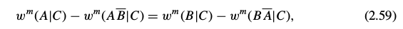

(2.28)和(2.38)的优点略有些相同。所以，从(2.40)的意义看，(2.58)是在S(x)上一致性的必要充分条件。

至此的结果可以被总结如下。逻辑积的结合律要求合情度x=A|B的一些单调方程w(x)必须遵循积准则(2.28)。结果(2.58)表明同样的方程必须也满足和准则

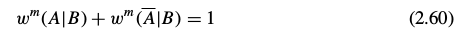

其中，m为正。当然，积准则自己也可以被同样的写为

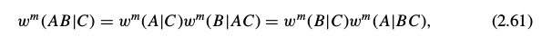

但是接着我们会看到m的值确实是无关的，不管她取值为什么，我们都可以定义一个新方程

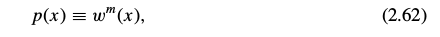

并且我们的准则可以有形式

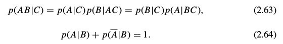

实际上，这没有失去一般性，因为唯一要求的是我们需要给方程w(x)增加条件：从w=0的不可能到w=1的确定之间连续单调递增的函数。但是如果w(x)满足这个条件，那么w^m(x)也同样要满足，0<m<\infty。所以，为了说我们可以用m的不同值，并没有给我们任何自由，就如在任意w(x)中我们并没有的那样。愿景所允许的所有可能被包含在(2.63)和(2.64)之中，在两式中是任意一个在范围0≤p(x)≤1的连续单调递增方程。

是否需要其他的关系来满足合情推理的完备准则，可以从(A_1,...,A_n的合情度中足以决定任意逻辑方程f(A_1,...,A_n)？我们有，在积准则(2.63)和和准则(2.64)中，结合命题AB和逆命题\bar{A}的合情度公式。但是，我们需要注意，在讨论上式(1.23)中，结合律和逆运算是运算集的一个完备集，它可以推导出所有的逻辑方程。

因此，有人会推断我们对基本规则的搜索应该结束了。它应该是有可能由积规则与和规则的重复使用，来到达由\{A_1,...,A_n\}产生的布尔代数中的任何合理度。为了验证这一点，我们寻求第一个公式逻辑和A+B。反复应用积规则与和规则，我们有

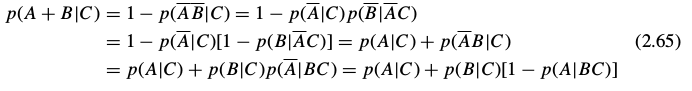

最后得到

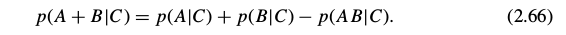

这个广义的和准则是在应用中最实用的一个。明显的，原始的和准则(2.64)是(2.66)的特殊形式，如果令B=\bar{A}。

练习2.1 是否通过能够积规则与和规则，找到p(C|A+B)类似(2.66)的一般形式呢？如果可以，推导出来；如果不可以，解释为什么不能够做到？

练习2.2 现在假设我们有一个以信息X为基础的命题集合\{A_1,...,A_n\}，各个命题是相互独立的：p(A_iA_j|X)=p(A_i|X)\delta _{ij}。证明是各个合情度的加权平均值：

为了拓展结果(2.66)，我们在上面的(1.17)曾指出出来矛盾之外的任意逻辑方程都可以表达为分离的一般形式，就如(1.17)中的基本命题并的逻辑和一样。如今，任意一个基本命题{Q_i, 1\le i \le 2^n }的合情度由积准则的反复使用来确定，然后通过(2.66)的反复使用可以得到任意逻辑和的合情度。实际上，这些基本命题并是相互独立的，所以我们可以发现（见下文(2.85)）这简化为简单和\sum_i p(Q_i|C)，其中最多有(2^n-1)项。

所以，就如并和逆是演绎逻辑的运算符完备集合，上面提到的和准则与积准则是合情推理的完备集合。只要是背景信息足够充分的确定基本命题并的合情度，我们的准则就足以来确定由\{A_1,...,A_n\}产生的布尔代数中的任何合理度。于是，在n=4的情形下，我们需要2^4=16个基本命题并的合情度，在那里我们的准则将会确定2^{16}=65536个布尔代数中基本命题并的合情度。

但是，这几乎总是比我们实际应用中所需要的多。如果背景信息足以来确定一小部分基本命题并的合情度，这可能就足以来确定一小部分我们所关心的布尔代数。

## 2.3 Qualitative properteis 定性属性

## 2.4 Numeraical values 数值

## 2.5 Notation and finite-sets policy 符号和有限集原则

Now we can introduce the notation to be used in the remainder of this work (discussed more fully in Appendix B). Henceforth, our formal probability Symbols, will use the capital P: 

P(A|B),                       (2.100)

which signifies that the arguments are propositions. Probabilities whose arguments are numerical values are generally denoted by other functional symbols, such as

f(r|np),                      (2.101)

which denote ordinary mathematical functions. The reason for making this distinction is to avoid ambiguity in the meaning of our symbols, which has been a recent problem in this field. However, in agreement with the customary loose notation in the existing literature, we sometimes relax our standards enough to allow the probability symbols with small p: p(x|y) or p(A|B) or p(x|B) to have arguments which can be either propositions or numerical values, in any mix. Thus the meaning of expressions with small p can be judged only from the surrounding context. 

It is very important to note that our consistency theorems have been established only for probabilities assigned on finite sets of propositions. In principle, every problem must start with such finite-set probabilities; extension to infinite sets is permitted only when this is the result of a well-defined and well-behaved limiting process from a finite set. More generally, in any mathematical operations involving infinite sets, the safe procedure is the finite-sets policy: 

Apply the ordinary processes of arithmetic and analysis only to expressions with a finite number of terms. Then, after the calculation is done, observe how the resulting finite expressions behave as the number of terms increases indefinitely. 

In laying down this rule of conduct, we are only following the policy that mathematicians from Archimedes to Gauss have considered clearly necessary for nonsense avoidance in all of mathematics. But, more recently, the popularity of infinite-set theory and measure theory have led some to disregard it and seek shortcuts which purport to use measure theory directly. Note, however, that this rule of conduct is consistent with the original Lebesgue definition of measure, and when a well-behaved limit exists it leads us automatically to correct ‘measure theoretic’ results. Indeed, this is how Lebesgue found his first results. 

The danger is that the present measure theory notation presupposes the infinite limit already accomplished, but contains no symbol indicating which limiting process was used. Yet, as noted in our Preface, different limiting Processes – equally well-behaved – lead in general to different results. When there is no well-behaved limit, any attempt to go directly to the limit can result in nonsense, the cause of which cannot be seen as long as one looks only at the limit, and not at the limiting process. 

This little ‘sermon’ is an introduction to Chapter 15 on infinite-set paradoxes, where we shall see some of the results that have been produced by those who ignored this rule of conduct, and tried to calculate probabilities directly on an infinite set without considering any limit from a finite set. The results are at best ambiguous, at worst nonsensical.

现在我们可以引入在本书其余部分使用的符号（在附录B中有更详细地讨论）。今后，正式的概率符号将使用大写的P：

P(A|B),                       (2.100)

这表明自变量是一个命题。当自变量是数值时,概率通常由其他函数符号表示，例如

f(r|np),                      (2.101)

这里的f表示普通的数学函数。作出这种区分的原因是为了避免符号的二意性，这曾在本领域中导致了一个问题。然而为了兼容现有文献中的对符号使用的随意性，有时候不得不放松了我们的标准，允许p的用法如：p(x|y)或p(A|B)或p(x|B),这里的自变量既可以是命题,也可以是数值,或者混合使用。因此要根据上下文来判断p的意义。

需要注意的是，我们的一致性定理只是为有限个命题的集合中各元素的概率而建立的。原则上，每个问题都必须以处理有限集的概率开始;只有存在一个定义良好且具有良好行为的极限过程,才允许将初始的有限集拓展为无限集。更一般地说，在涉及无限集合的任何数学运算中，正确的做法是遵守有限集原则：

将常规的算术和分析过程仅应用于有限个项的表达式。然后，在完成计算之后，观察得出的有限项表达式随着项的数目无限增加而表现出的行为。

在制定这一行为规则时，我们只是遵循从阿基米德到高斯的数学家认为的,在所有数学中都是无合适理由则必须遵守的原则。但是，最近无限集合理论和测度论的广泛应用导致一些人抛弃了这个原则，转而寻求直接使用度量理论的捷径。但是请注意，最早的勒贝格测度的定义是符合这个指导原则的，当存在一个有良好行为的求极限过程时，就自然会得出和使用“测度论”一样的结果。实际上，这就是勒贝格如何发现他的第一个结果的。

危险在于，现在测度论的符号体系已经预先假设极限是存在的，却无法表示出使用了哪种求极限过程。然而，正如我们的序言所指出的，不同的求极限过程-都是良好的-通常可能导向不同的结果。当没有良好的求极限过程时，任何直接使用极限的做法都可能导向无意义的结果，谬误的原因就是只看极限不看过程。

本节是第15章中关于无限集悖论的简介.在第15章中,我们将看到忽略这个原则的人所得出的结果，他们试图直接在无限集上计算概率，而不是对有限集求极限。其结果在最好的情况下会是含混不清的，最坏的时候就谬论。

## 2.6 Comments 评论

It has taken us two chapters of close reasoning to get back to the point (2.99) from which Laplace started some 180 years ago. We shall try to understand the intervening period, as a weird episode of history, throughout the rest of the present work. The story is so complicated that we can unfold it only gradually, over the next ten chapters. To make a start on this, let us consider some of the questions often raised about the use of probability theory as an extension of logic.

我们已经用了两章来讨论推理,从180年前拉普拉斯的观点(2.99)开始.在本书的余下部分,我们将试图了解在从此之后的,充满着不可思议之插曲的历史,我们将在接下来的十章中逐步展开这错综复杂的整个故事.作为开始，让我们先看看把概率论用于广义逻辑时常常被提出的问题。

### ‘Subjective’ vs. ‘objective’ “主观”与“客观”

These words are abused so much in probability theory that we try to clarify our use of them. In the theory we are developing, any probability assignment is necessarily ‘subjective’ in the sense that it describes only a state of knowledge, and not anything that could be measured in a physical experiment. Inevitably, someone will demand to know: ‘Whose state of knowledge?’ The answer is always: ‘That of the robot – or of anyone else who is given the same information and reasons according to the desiderata used in our derivations in this chapter.’

Anyone who has the same information, but comes to a different conclusion than our robot, is necessarily violating one of those desiderata. While nobody has the authority to forbid such violations, it appears to us that a rational person, should he discover that he was violating one of them, would wish to revise his thinking (in any event, he would surely have difficulty in persuading anyone else, who was aware of that violation, to accept his conclusions).

Now, it was just the function of our interface desiderata (IIIb), (IIIc) to make these probability assignments completely ‘objective’ in the sense that they are independent of the personality of the user. They are a means of describing (or, what is the same thing, of encoding) the information given in the statement of a problem, independently of whatever personal feelings (hopes, fears, value judgments, etc.) you or I might have about the propositions involved. It is ‘objectivity’ in this sense that is needed for a scientifically respectable theory of inference.

这两个词在概率论中被用滥了，下面我澄清我的用法。在我们正在发展的理论中，任何概率一定是“主观”的，因为它只描述了一种知识的状态，而不是物理实验中可以测量的任何东西。不可避免的是，有人会要求知道：“是哪个人具有的知识的状态？”答案总是：“机器人的-或者基于同样的给定信息和同样的基本假设(本章中派生出来的),进行推理的任何人。 “

无论是谁拥有同样的信息，但得出了和机器人不一样的结论，那么它一定违反了某个基本假设.虽然没有一个权威规定任何违反不得存在,但在我们看来，如果一个理性的人发现自己违反了基本假设，肯定愿意做出改正(因为如果别人意识到了他违反了基本假设,他无论如何都难以说服别人接受他的结论）.

现在，正我们的基本假设的接口(IIIb)(IIIc)使得概率完全“客观”,即独立于使用者的个性。它是一种对问题陈述中所提供的信息进行的描述手段（或者可以说是一种编码），不管你或我对相关命题可能拥的个人感受（希望，恐惧，价值判断等）。从这个意义上讲，这是一个科学上可接受的推论理论所需要的“客观性”。

### 2.6.2 Gödel’s theorem

To answer another inevitable question, we recapitulate just what has and what has not been proved in this chapter. The main constructive requirement which determined our product and sum rules was the desideratum (IIIa) of ‘structural consistency’. Of course, this does not mean that our rules have been proved consistent; it means only that any other rules which represent degrees of plausibility by real numbers, but which differ in content from ours, will lead necessarily either to inconsistencies or violations of our other desiderata. 

为了回答另一个无法回避的问题,我们总结一下在本章中已经证明了和还未证明的部分.按照"结构一致性的"基本公理(IIIa)的要求,我们构建了乘法和加法的规则.当然,这并没有证明这些规则是一致无矛盾的;只是说明其他任何一个同样将可能性用实数表示,但内容和我们不同的规则,都将与其他几条基本公理相矛盾或冲突.

A famous theorem of Kurt Gödel (1931) states that no mathematical system can provide a proof of its own consistency. Does this prevent us from ever proving the consistency of probability theory as logic? We are not prepared to answer this fully, but perhaps we can clarify the situation a little.

著名的哥德尔定理指出,没有一个数学系统能够证明自身是一致的.但这是否意味着我们无法证明用于逻辑的概率论的一致性?我们不会给出完整的回答,不过我们会让事情稍微变得更清楚一点.

Firstly, let us be sure that ‘inconsistency’ means the same thing to us and to a logician. What we had in mind was that if our rules were inconsistent, then it would be possible to derive contradictory results from valid application of them; for example, by applying the rules in two equally valid ways, one might be able to derive both P(A|BC) = 1/3 and P(A|BC) = 2/3. Cox’s functional equations sought to guard against this. Now, when a logician says that a system of axioms {A 1 , A 2 , . . . , A n } is inconsistent, he means that a contradiction can be deduced from them; i.e. some proposition Q and its denial Q are both deducible. Indeed, this is not really different from our meaning.

首先我们要弄清楚对于"不一致"这个词,我们和逻辑学家的理解是一样的.在我们的看法里,如果说我们的规则是不一致的,那么意味着应用这些规则可以得到矛盾的结论;举例来说,通过两种等价且合法的方式应用规则,可以同时得到结论P(A|BC) = 1/3和P(A|BC) = 2/3.Cox的函数等式就是为了防止这个问题的出现.现在如果一个逻辑学家说一个公理系统{A 1 , A 2 , . . . , A n }是不一致的,他的意思是从这些公理可以演绎推理出矛盾;例如,命题Q及其否命题!Q都能被演绎推理得出.这与我们的理解其实并无差异.

To understand the above Gödel result, the essential point is the principle of elementary logic that a contradiction A A implies all propositions, true and false. (Given any two propositions A and B, we have A ⇒ (A + B), therefore A A ⇒ A(A + B) = A A + A B ⇒ B.) Then let A = {A 1 , A 2 , . . . , A n } be the system of axioms underlying a mathematical theory and T any proposition, or theorem, deducible from them: [1]

为了理解哥德尔的结论,本质的一点是基本逻辑原理,即矛盾的A!A蕴涵了所有命题,无论真与假.(给定任何两个命题A和B,则有A ⇒ (A + B), 所以AA⇒A(A+B)=A A+AB⇒B).然后让A = {A 1 , A 2 , . . . , A n }是一个数学理论的公理系统,T是任何一个从公理演绎推理出的命题或定理,

A ⇒ T. (2.102)

Now, whatever T may assert, the fact that T can be deduced from the axioms cannot prove that there is no contradiction in them, since, if there were a contradiction, T could certainly be deduced from them! 

现在,无论T表述了什么,T可以从公理演绎推理出来的事实并不能证明公理系统中不存在矛盾,因为如果有矛盾存在的话T肯定能被演绎推理得到!

This is the essence of the Gödel theorem, as it pertains to our problems. As noted by Fisher (1956), it shows us the intuitive reason why Gödel’s result is true. We do not suppose that any logician would accept Fisher’s simple argument as a proof of the full Gödel theorem; yet for most of us it is more convincing than Gödel’s long and complicated proof. [2]

这就是哥德尔定理的和我们问题有关的精髓.正如Fisher(1956)注意到的,这展示了哥德尔结论正确性的直觉原因.我们不是在建议逻辑学家们把Fisher的简单论证作为对哥德尔定理的完整证明;只是对我们的大多数来说,这比既长又复杂的证明更易于令人易于接受.

Now suppose that the axioms contain an inconsistency. Then the opposite of T and therefore the contradiction T T can also be deduced from them:

现在假设公理系统中有矛盾存在,那么T的否定和矛盾命题T!T都可演绎得到:
A ⇒ !T .    (2.103)

So, if there is an inconsistency, its existence can be proved by exhibiting any proposition T and its opposite T that are both deducible from the axioms. However, in practice it may not be easy to find a T for which one sees how to prove both T and T . 

所以,如果存在矛盾,那么只要找到任何命题T及其否命题!T都能被演绎推理出来就能证明存在矛盾.然而,实际上想要找到并证明T和!T往往并不是一件容易的事.

Evidently, we could prove the consistency of a set of axioms if we could find a feasible procedure which is guaranteed to locate an inconsistency if one exists; so Gödel’s theorem seems to imply that no such procedure exists. Actually, it says only that no such procedure derivable from the axioms of the system being tested exists. 

显而易见,如果我们能找到一个切实可行的过程来保证找到矛盾如果真的存在矛盾的话,我们就能证明一个公理系统是否是一致的;因而哥德尔定义似乎暗示了这种过程并不存在.事实上哥德尔定理表述的是,此过程不能从公理系统本身所演绎推理得到.

We shall find that probability theory comes close to this; it is a powerful analytical tool which can search out a set of propositions and detect a contradiction in them if one exists. The principle is that probabilities conditional on contradictory premises do not exist (the hypothesis space is reduced to the empty set). Therefore, put our robot to work; i.e. write a computer program to calculate probabilities p(B|E) conditional on a set of propositions E = (E 1 E 2 . . . E n ). Even though no contradiction is apparent from inspection, if there is a contradiction hidden in E, the computer program will crash.

我们会发现概率论和这个过程很像,概率论是一个强有力的分析工具,它可以搜索出一组命题并检测其中是否存在矛盾.原理是,概率依赖于前提假设中不存在矛盾(假设空间演绎缩减为空集).因此,当我们的机器人工作的时候,例如一个从一组命题E = (E 1 E 2 . . . E n )来计算p(B|E)的概率的程序.即使我们没能检测出存在矛盾,但如果E中确实隐藏了矛盾的话,这个程序终将崩溃.

We discovered this ‘empirically’, and, after some thought, realized that it is not a reason for dismay, but rather a valuable diagnostic tool that warns us of unforeseen special cases in which our formulation of a problem can break down.

从"经验"上我们发现了这点,并经过一些思考后,认识到我们不应为此气馁,相反这是一个很有价值的诊断工具,它能够警告我们被公式化的问题可能在某些特殊情况下将会失败.

If the computer program does not crash, but prints out valid numbers, then we know that the conditioning propositions E i are mutually consistent, and we have accomplished what one might have thought to be impossible in view of Gödel’s theorem. But of course our use of probability theory appeals to principles not derivable from the propositions being tested, so there is no difficulty; it is important to understand what Gödel’s theorem does and does not prove.

如果程序没有崩溃,而是输出了合法数值,那么我们就能知道条件命题Ei是互相一致的,虽然从哥德尔定理角度看这似乎是不可能得到的结果.由于我们用到的概率论基于的原理并非源于被测命题,所以证明矛盾不存在看起来不是很困难;重要的是明白那些是哥德尔定理证明了的,而那些不是.

When Gödel’s theorem first appeared, with its more general conclusion that a mathematical system may contain certain propositions that are undecidable within that system, it seems to have been a great psychological blow to logicians, who saw it at first as a devastating obstacle to what they were trying to achieve. Yet a moment’s thought shows us that many quite simple questions are undecidable by deductive logic. There are situations in which one can prove that a certain property must exist in a finite set, even though it is impossible to exhibit any member of the set that has that property. For example, two persons are the sole witnesses to an event; they give opposite testimony about it and then both die. Then we know that one of them was lying, but it is impossible to determine which one.

当哥德尔定理刚出现的时候,它的普遍性的结论即一个数学系统可能包含一些不能在该系统内证伪的命题,这给逻辑学家一个巨大的心理上的打击,他们将其视作达到目标的路上的一个毁灭性的障碍.但略作思考后,我们意思到很多简单的问题都无法通过演绎逻辑来判定.例如在一个有限集合中,可以证明必然存在一种属性,却无法找到集合的任何一个元素具有该属性.举例来说,一个事件的目击人只有两个,他们给出了相反的证词然后都死了.那么我们知道必然有一个人说谎了,却没法知道是谁.

In this example, the undecidability is not an inherent property of the proposition or the event; it signifies only the incompleteness of our own information. But this is equally true of abstract mathematical systems; when a proposition is undecidable in such a system, that means only that its axioms do not provide enough information to decide it. But new axioms, external to the original set, might supply the missing information and make the proposition decidable after all.

在这个例子中,不可判定性既不属于命题,也不属于事件;只是说明了我们拥有的信息是不完全的.但我们的抽象数学系统同样如此,如果系统中有一个命题是不能判定的,只是意味着系统的所有公理未能提供足够的信息来做出判定.但是如果增加原始系统之外的新公理的话,即可以提供那些遗失掉信息的话,我们就可以对该命题做出判定了.

In the future, as science becomes more and more oriented to thinking in terms of information content, Gödel’s result will be seen as more of a platitude than a paradox. Indeed, from our viewpoint ‘undecidability’ merely signifies that a problem is one that calls for inference rather than deduction. Probability theory as extended logic is designed specifically for such problems.

在未来,随着科学更多的基于信息提供的内存来思考,哥德尔的这个结论看起来更像是一个陈词滥调而不是悖论.事实上,从我们的观点看,"不能判定"仅仅意味我们需对一个问题做出推断更甚于对其进行演绎.将概率论视为广义逻辑恰恰就是为这类问题而设计的.

These considerations seem to open up the possibility that, by going into a wider field by invoking principles external to probability theory, one might be able to prove the consistency of our rules. At the moment, this appears to us to be an open question.

如上的这些考虑看起来是开启了,通过借助概率论之外的原理来进入更广阔的领域的可能性,由此可以证明我们的规则的一致性.在这一刻,对我们而已只是一个开放性问题而已.

Needless to say, no inconsistency has ever been found from correct application of our rules, although some of our calculations will put them to a severe test. Apparent inconsistencies have always proved, on closer examination, to be misapplications of the rules. On the other hand, guided by Cox’s theorems, which tell us where to look, we have never had the slightest difficulty in exhibiting the inconsistencies in the ad hoc rules which abound in the literature, which differ in content from ours and whose sole basis is the intuitive judgment of their inventors. Examples are found throughout this book, but particularly in Chapters 5, 15, and 17.

不必说,在正确应用我们的规则的情况下从未出现过不一致的情况,虽然我们的一些计算需要对其进行严格的测试.显而易见的不一致经过仔细的检验,总是被证明为对规则的错误应用.另一方面,在告诉我们从哪里下手的Cox定理的指导下,我们很容易就能找到在某些文献中使用特殊规则而导致的不一致,这些特殊规则的内容往往与我们的不同,而且其唯一的依据是发明人的直觉判断.这种例子遍布本书,尤其是在第5,15,17章中.

[1] In Chapter 1 we noted the tricky distinction between the weak property of formal implication and the strong one of logical deducibility; by ‘implications of a proposition C’ we really mean ‘propositions logically deducible from C and the totality of other background information’. Conventional expositions of Aristotelian logic are, in our view, flawed by their failure to make explicit mention of background information, which is usually essential to our reasoning, whether inductive or deductive. But, in the present argument, we can understand A as including all the propositions that constitute that background information; then ‘implication’ and ‘logical deducibility’ are the same thing.

在第一章中,我们注意到逻辑演绎的蕴涵的强弱形式之间的微妙区别,说"命题C蕴涵了命题Q",我们其实想表达"命题Q可以从C以及其他所有背景信息中逻辑演绎得出".阿里士多德逻辑的传统解释是,在我们看来,其缺陷是没有显式的指出背景信息,而背景信息恰恰是推断亦或演绎的根本所在.但在我们的论证中,我们理解A包括了所有代表了背景信息的命题,所以"蕴涵"和"逻辑演绎"看起来是同一件事情.

[2] The 1957 edition of Harold Jeffreys’ Scientific Inference (see Jeffreys, 1931) has a short summary of Gödel’s original reasoning which is far clearer and easier to read than any other ‘explanation’ we have seen. The full theorem refers to other matters of concern in 1931 but of no interest to us right now; the above discussion has abstracted the part of it that we need to understand for our present purposes.

注2: 在Harold Jeffreys的1957年版的<科学的推理>(见Jeffresy, 1931)中给出了一个高德尔的精简的原始证明,这个证明比我们见到的任何其他的'解释'都更清晰易懂.定理的完整说明会涉及一些1931年的重要事件,但不在我们现在的关注范围之内;上面的讨论已经将其中与我们相关的部分概括进来了.

### 2.6.3 Venn diagrams 韦恩图

译注: 大意是Venn图附带了更多的额外信息,但对于建立概率逻辑系统并不是必须的.

### 2.6.4 The ‘Kolmogorov axioms’ 柯尔莫哥洛夫公理

译注: 柯尔莫哥洛夫基于集合论和测度论建立的概率体系,可描述的问题范围小于作者的体系.柯尔莫哥洛夫理论可参考附录1.
