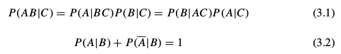
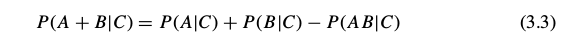
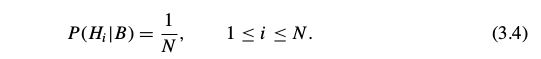
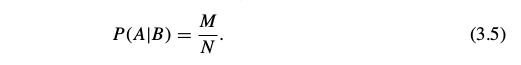

# 3 Elementary sampling theory 基本采样理论

At this point, the mathematical material we have available consists of the basic product and sum rules

目前为止,我们得到的数学元素包括乘法和加法规则:

from which we derived the extended sum rule
由此扩展出加规则

and with the desideratum (IIIc) of consistency, the principle of indifference: if on background information B the hypotheses (H 1 , H 2 , . . . , H N ) are mutually exclusive and exhaustive, and B does not favor any one of them over any other, then

根据一致性公理(IIIc),即无差异原理:如果背景信息B,假设集(H1, ..., Hn)是互斥且穷尽的,而且B不偏好任何一个,则

From (3.3) and (3.4) we then derived the Bernoulli urn rule: if B specifies that A is true on some subset of M of the H i , and false on the remaining (N − M), then

从(3.3)和(3.4)我们得出伯努利盒规则:如果B规定了对Hi的一个子集M有A为真,且对剩余的(N-M)为假,则

It is important to realize how much of probability theory can be derived from no more than this.

重要的是看看我们仅从上述规则得出多少概率论的结果。

In fact, essentially all of conventional probability theory as currently taught, plus many important results that are often thought to lie beyond the domain of probability theory, can be derived from the above foundation. We devote the next several chapters to demonstrating this in some detail, and then in Chapter 11 we resume the basic development of our robot’s brain, with a better understanding of what additional principles are needed for advanced applications.

事实上，目前教授的所有传统概率理论，包括许多常常被认为是基于概率论之外的理论而得出的重要结论，都可以从上面几条推导而来。在接下来的几章中，我们将展示各种细节，然后在第11章中再回到设计机器人的大脑上来，伴随着高级应用所需的其他的原理的更好理解。

The first applications of the theory given in this chapter are, to be sure, rather simple and naive compared with the serious scientific inference that we hope to achieve later. Nevertheless, our reason for considering them in close detail is not mere pedagogical form. Failure to understand the logic of these simplest applications has been one of the major factors retarding the progress of scientific inference – and therefore of science itself – for many decades. Therefore we urge the reader, even one who is already familiar with elementary sampling theory, to digest the contents of this chapter carefully before proceeding to more complicated problems.

本章中首先给出的理论应用是简单和单纯的，和我们之后希望得到的严肃的科学推断相比。尽管如此，我们详细考察这些细节并不是为了教学的缘故。由于没能正确理解对逻辑的这些简单应用，许多年来曾是阻碍了科学推理的发展--因此也阻碍了科学本身的发展--的重要因素。因此我们要求读者，即使你已经对基本采样理论了熟于胸，在研究接下来的复杂问题之前，也请认真的咀嚼一下本章的内容。
