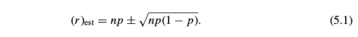

# 5 Queer uses for probability theory

I cannot conceal the fact here that in the specific application of these rules, I foresee many things happening which can cause one to be badly mistaken if he does not proceed cautiously.

James Bernoulli (1713, Part 4, Chapter III)

我不能遮盖的一个事实是:我预见到,如果在应用这些规则的时候不够谨慎仔细,可以导致各种各样拙劣的错误.

詹姆斯.伯努利(1713, 第四部分, 第三章)

I.J.Good (1950) has shown how we can use probability theory backwards to measure our own strengths of belief about propositions. For example, how strongly do you believe in extrasensory perception?

I.J.Good已经展示了如何用概率论来反向测量对命题的坚信度.举例来说,你有多相信存在超级第六感?

## 5.1 Extrasensory perception 超级第六感

What probability would you assign to the hypothesis that Mr Smith has perfect extrasensory perception? More specifically, that he can guess right every time which number you have written down. To say zero is too dogmatic. According to our theory, this means that we are never going to allow the robot’s mind to be changed by any amount of evidence, and we don’t really want that. But where is our strength of belief in a proposition like this?

对于斯密斯先生具有完美的超级第六感这个假设,你认为概率应该是多少是合适的?更明确的说,他能准确的猜出你每一次写在纸上的一个数字.如果说概率是零就太武断了.按我们的理论,这意味着不论有多少证据,我们都不允许机器人改变这个想法,这不是我们希望出现的.但是对于这种命题,我们的信任是从哪里而来的?

Our brains work pretty much the way this robot works, but we have an intuitive feeling for plausibility only when it’s not too far from 0 db. We get fairly definite feelings that something is more than likely to be so or less than likely to be so. So the trick is to imagine an experiment. How much evidence would it take to bring your state of belief up to the place where you felt very perplexed and unsure about it? Not to the place where you believed it – that would overshoot the mark, and again we’d lose our resolving power. How much evidence would it take to bring you just up to the point where you were beginning to consider the possibility seriously?

我们大脑的工作方式和机器几乎完全一样,但是只有在概率和0差别不大时,我们才对概率有一种直觉的感受.我们有一种明确的感觉,事情极可能如此,或是极不可能.窍门就是想象一个实验,需要获得多少证据,才会让你达到感觉迷惑和无法确定的状态?如果证据多到足以让你确信,我们就失去了解决问题的动力了,这就超过我们的目标了.证据积累到什么程度,才能让你开始严肃的考虑其概率是什么?

So, we consider Mr Smith, who says he has extrasensory perception (ESP), and we will write down some numbers from one to ten on a piece of paper and ask him to guess which numbers we’ve written down. We’ll take the usual precautions to make sure against other ways of finding out. If he guesses the first number correctly, of course we will all say ‘you’re a very lucky person, but I don’t believe you have ESP’. And if he guesses two numbers correctly, we’ll still say ‘you’re a very lucky person, but I still don’t believe you have ESP’. By the time he’s guessed four numbers correctly – well, I still wouldn’t believe it. So my state of belief is certainly lower than −40 db.

现在,对于斯密斯先生,他说他有超级第六感,我们找张纸在上面写一个零到十之间的数字,然后让斯密斯来猜我们写的是几.我们会小心的不让他能看到我们写了什么.如果第一次他猜对了,我们会说:'你运气真好,但我还是不相信你有第六感.'如果他猜对了两次,我们还是会说:'你的运气真实太好了,但我还是不相信你有第六感.'直到第四次他都猜对了,好吧,但我还是不相信.所以此时,我们的确信度显然是低于-40分贝的.

How many numbers would he have to guess correctly before you would really seriously consider the hypothesis that he has extrasensory perception? In my own case, I think somewhere around ten. My personal state of belief is, therefore, about −100 db. You could talk me into a ±10 db change, and perhaps as much as ±30 db, but not much more than that.

他需要猜对多少次,才能让你认真的考虑假设:他有第六感?对我而言,大概是十次.即我的确信度大概是-100分贝.你可以让我的确信度达到+_10分贝,甚至+_30分贝,但绝不可能更多了.

After further thought, we see that, although this result is correct, it is far from the whole story. In fact, if he guessed 1000 numbers correctly, I still would not believe that he has ESP, for an extension of the same reason that we noted in Chapter 4 when we first encountered the phenomenon of resurrection of dead hypotheses. An hypothesis A that starts out down at −100 db can hardly ever come to be believed, whatever the data, because there are almost sure to be alternative hypotheses (B1,B2,...) above it, perhaps down at −60 db. Then, when we obtain astonishing data that might have resurrected A, the alternatives will be resurrected instead. Let us illustrate this by two famous examples, involving telepathy and the discovery of Neptune. Also we note some interesting variants of this. Some are potentially useful, some are instructive case histories of probability theory gone wrong, in the way Bernoulli warned us about.

到目前为止,我们看到,虽然我们的结论是正确的,但还是和整个事情相去甚远.实际上,即使他猜对了1000次,我还是不相信他有第六感,这和我们在第四章中看的复活一个没戏的假设的理由一样.无论多少数据,从-100分贝开始的假设A很难被相信,因为总是还有其他的假设(B1,B2,...)比A高,大概从-60分贝开始.所以,即使令人惊讶的数据可能修正了A,但其他假设也同时被修正了.让我们举两个著名的例子来说明一下,一个是有关心灵感应的,一个是海王星的发现.我们也发现了这两个例子的一些变种,一些可能是有潜在用处的,一些是有教育意义的历史上的概率论的错误发展的例子,就像伯努利对我们的警告一样.

## 5.2 Mrs Stewart’s telepathic powers

